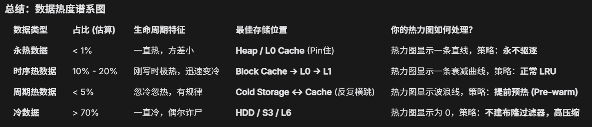
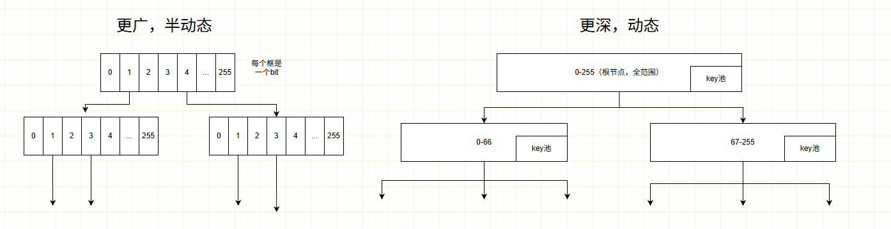
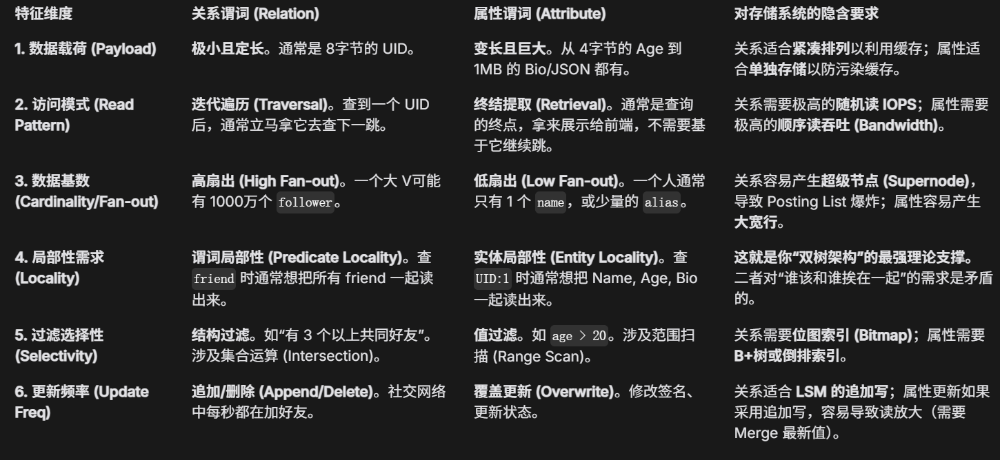

### 一些系统常识
  - 1.缺页中断
    首先，一般来说的缺页中断都是指的是OS的基本逻辑单位页（基本都是4KB）。此外，还有实际上SSD内也有“页”的概念，这个“页”和OS的页不一定对等，可能为4KB ～ 16KB
    Linux 内核有 预读算法 ，当 OS 发现你在顺序访问内存地址，触发一次 Page Fault 时，OS 可能会一次性从 SSD 发起一个 16KB ~ 128KB（甚至更大，可配置）的 I/O 请求。
    SSD 的顺序读取速度依然远快于随机读取（通常快 3-10 倍）。
  - 2.数据热度谱图（NOTE:AI生成）
    
### BadgerDB的特点（基本就是wiskey那篇论文）
  - 1.KV分离（分界值默认是1MB）
  - 2.KV分离导致的GC
  - 3.从BadgerDB和DGraph的联合结构上入手
  - 4.NOTE:NOTE:特别注意，点查时，BadgerDB是从高层到底层一层一层找满足的KV对，一旦找到就直接返回！！所以不能写入旧版本时间戳的KV对！

### 可以调整的参数
  - 1.层级个数
  - 2.层级大小（比例）
  - 3.大小KV分界值
  - 4.内存表（MemTable）大小，大则写放大下降，小则写放大增大
  - 5.压缩触发的阈值（BadgerDB是基础优先级加调整）
  - 6.执行压缩的协程数目（现在为4）
  - 7.缓存块大小
  - 

### 很慢的操作
  - 1.范围查询：需遍历LSM-tree所有层级，收集各有序运行段的最新条目，确保不遗漏目标键范围内数据
  - 2.GC
  - 3.压缩：当 LSM-Tree 达到 Compaction 触发条件（如 L0 文件数超标、某层数据量超限）时，用户的写操作（如 Put/Delete）或读操作可能延迟升高。
  - 

### 创新点
  NOTE:如果不大改数据结构，点查询的优化力度不会太大，因为点查询可以在内存直接定位到目标SST！
  NOTE:感觉现在下面的 3 6 7可以联合起来写一个XXXKV引擎，然后主题就写面向图存储优化的KV存储引擎
  NOTE:如果涉及到图数据库的话，那么对比试验是个大问题，因为只能和自身对比，而顶会都是有很多对比实验的！！！！Dgraph因为事务级一致性等本身就比较慢，而且Dgraph指定了BadgerDB，替换也不方便！！
  - 1.ABANDON:分布式的压缩或者GC，即让备份节点之间来负担这种大计算量的操作
      PS：但执行顺序可能会出现略微不同？然后导致整体结构就不太一样？而且因为BadgerDB不是分布式的，所以实现很困难，相当于在一个数据库上完整的实现RAFT，所以还是从其他方面看吧
      PS：TiKV和CockroachDB是分布式的
  - 2.查询旧数据的时候，因为压缩的问题，他会逐层向更更高层压缩，然后有的旧数据实际是访问度很高的，比如地区什么的这种不怎么会变化的KV对，那么是否有可能把这些旧的热的数据执行一个上升呢
  - 3.NOTE:还有BadgerDB是块结构的缓存，而DGraph貌似是图结构（即偏条目缓存的），那么这两个有没有什么联合优化的操作呢？
      比如这两个缓存有很多时候缓存的内容是重复的，那么如果将高层（DGraph）的缓存条目对应的命中度在底层（BadgerDB）减去，那么缓存的利用率不就更高了，而且可以对于两种缓存方式的优点整合
      PS：得看具体实际使用时，开DGraph的缓存时，BadgerDB还会开吗？应该会开，实际想一下就知道二者应用环境不同。
      PS：因为条目缓存空间的利用率还有效果更好，但细粒度也导致了其计算量要比块缓存大。而块缓存计算量小，但是一个块里面的8条目未必都是经常访问的（块缓存的底层思想还是空间局部性）
  - 4.把RangeCache的思想推到DGraph层级，根据哪些谓词构建了可以排序的索引，然后就对这些个谓词进行一个范围缓存，来加速DGraph图的范围条件查询
  - 5.（还需再想一想）已知LSM-Tree的数据除了压缩不会改变，而GC是逐层遍历去找当前KV是否仍然有效，那么是否可以用布隆过滤器来对每次压缩的当前层生成一个编码，
      然后用编码判断当前KV是否还存在于某一层（就算假阳性也无所谓，概率太低，所以多余的数据也不会多太多）
      PS：目前布隆应用的对象是SST，所以这里的意思就是把布隆应用在level，而布隆应用的对象可以是key+版本号
      PS：TODO:现在需要考虑的是对整层布隆的代价大不大（可以增大误判率来减少代价）
      PS：还有现在布隆的对象是谁，仅仅一个key吗？是的，是不带时间戳的KEY

  - 6.NOTE:生成一个查询记录KV对的热力图，其内又分为管整个历史的全局热力图以及临时热力图。本质上是利用了空间局部性（应该尽量避免涉及数据的永久改变，因为数据的热度是会变化的）
      NOTE:如果用全局热力图来做范围匹配的话，会出现“假热”的问题！所以最好是具体的单个SST的热力值（在生成imemtable的时候直接根据全局热力图预计计算出当前SST的热力，此后在压缩的时候可以顺带更新SST的热力值）
      NOTE:不能当行缓存用，因为当行缓存的话，维护的逻辑特别复杂（如每进入一个KEY就要排序，且为了区分各个样本的权重，还需要额外的计数器！！而且key的版本也是一大问题！此外同key的剔除也是一个问题），这样的话就会导致计算开销很大？而且实现起来比较复杂，第一版先只判断出区域热度吧！
      
      NOTE:NOTE:下面这一块是本热力图的核心————读写比
      NOTE:注意不能用训练一个函数来决定某个key是否热，因为比如 成龙 会是热的，但也会有成龙1，成龙2类似的小号来干扰，也会有问题。所以热力图的核心应该是在读写比上面
      NOTE:而读写比则主要需要看三个方面。首先，单个节点内的读写比；节点内读写与总读写各自的比值；节点读写比如何子代继承
      NOTE:1.单个节点内的读写比可以看作块的分裂条件，毕竟根本目标是要找到读多写少的范围。所以，如果某一个节点 读:写 达到了3以上，可以就直接暂时性的禁止分裂，当超过了再允许分裂。
      NOTE:2.节点内读写与总读写各自的比值则表示了当前块在全局上面的意义。比如如果一个节点读写比很理想，而且读占了总读较多，而写占了总写较少，那么就可以判断出是极优范围，让其常住内存。
      TODO:3.节点读写比如何子代继承。读继承好说，写如何继承？

      NOTE:NOTE:对于分裂，应该高层的（或者全部）都应该每层以分裂5个或者以上的范围为目标（除非前缀不同的个数不足5个），这样比较好查询（TODO:或者当达到禁止分裂的条件时，将目标范围加到内存中一个数组上？这样就可以直接看目标key是否在这个数组内，不在的话就说明是劣质key!）

      NOTE:用法1（a）：全局热力图的更大的价值是在预判新增的key是否热，所以可以在内存中生成两个memtable，然后分冷热memtable，冷memtable直接打入底层（或者逐层合并的时候优先选择热力度最低的，而不是最旧的），热的在高层停留（或者看看如何做到将热的和热的聚合，可以在到达L0层时，直接选择两个热Mem进行合并）
        PS:这个有个问题，并行的两个memtable的如何保证数据时间顺序上的正确性呢？因为某个范围的热度可能是会变化的，如果变化的话，那么可能先变为imem的反而是新版本数据！
        解决这个问题，需要保证某段时间范围内key范围热度不变（NOTE:这个可行性比较高，即只在imem生成的时候（无论是热imem或者mem都可以？如果某个热度范围一直横跳，此时会导致一样的问题！！）再去更新热key范围列表）。
        或者在查询的时候需要两边都遍历？（这个就有点太慢了！）

      NOTE:用法2(a)：临时热力图辅助判断缓存块在内存的去留，最终缓存中块的去留由 留存分（a*热度 + b*LFU分）决定（可以用全局热力图主动去找出永热数据，让其永驻）
      NOTE:用法3(b)：根据全局热力图对Vlog也分热Vlog和冷Vlog（这个可看看如何只看写热的区域），写入的时候看热力图，重写Vlog时再根据全局热力图更新各个KV的归属
      NOTE:用法4(a)：（再考虑）在选择压缩方法的时候，如果是很热的SST，那么就不压缩，以换取极大的读速。如果是冷的，那么就用更大的压缩比算法
      NOTE:用法5(a)：在压缩以及初始写入（主要）的时候适度提高热读区域的KV分离阈值（因为分离后会导致读慢），降低冷区域的KV分离阈值（因为这样可以压缩LSM树的大小）
      NOTE:用法6(a)：对于又热，又有大写入，且有共同前缀的范围特殊处理，其Key的公共前缀直接剥离到当前SST的元数据区域（前提是需要在L0层内进行合并）
      NOTE:用法7(b)：对于热写的区域，构造一个内存中的墓碑标记（同理去除共有前缀），可以与前面的用法二联动，这样就不用去查LSM树了
      NOTE:用法8(a)：对于热读区域，构造更高精度的布隆过滤器
      PS：a标识只需要读热分裂即可，b标识需要还需要写热分裂 NOTE:所以，现在可以得知，只需要热读分裂就可以完成大部分功能！！写热当作辅助判断！
      PS：热力图最好是分段线性回归函数，因为SST是范围的原因，感觉最好用直接key的，不要用范围的
      
      NOTE:特别注意，这个创新点很大程度上依赖于数据在空间局部性是否效果好，而时序数据库天然的在空间局部性上极强（数据的聚集性特别强，而且数据KV对的连续性高，哪怕不考虑假热的问题或许都没有什么太大问题）
      TODO:设置热力图的更新周期可以设置为 总缓存大小/平均KV大小？
      TODO:这个热力图周期性构造，然后合并之前的好？还是不断对同一张图进行更新好？而且应该再多一个数据位来判断连续热
      TODO:怎么分出来永热、周期热、时常热、冷数据呢？（或者换句说法是怎么构造以及怎么具体使用全局热度图和临时热度图）
      TODO:热力图可以分为写热和读热？读写比也很重要！！而且写应该看全局统计呢，还是局部的呢？
      TODO:key的粒度如何区分，如果区分的粒度太细，会导致函数段太分散，而如果区分的粒度太粗，又会导致大量的集中
      TODO:读热和写热对于蓄水池的影响应该怎么判断？或者可以只按照读来分裂，而不是二者的合来判断分裂？
      TODO:时间戳貌似也会有大用处，比如用时间戳来判断读取的是近期写入的数据还是老旧数据（时间戳是严格递增的，用时间戳来划分热力图的版本）

      NOTE:现在热度图可以有三种构建方式：
        
        NOTE:一种是动态的，用热度桶二叉树（每层判断一个字节大小，从多点分裂，每分裂一个层级，热力值的判断权重就更高一点，注意每层就严格对应一个字节，然后下一层就是下一个字节的对半分（或者更多片分），这样可以保证树的深度不会太离谱，即便如此，30次对比也是不可接受的，所以这个用采样的方式更好！）。 NOTE:而且这个可以参考 SuRF 的实现，可以完美兼容，用SuRF就可以做到每个字节仅仅用256bit即可判断出来！

        NOTE:还有一种也是动态的，首先基本结构是二叉树，其内的每个节点就代表一个个范围，从根节点构造一个完整的包含所有Key的范围，子节点是父节点范围的分裂，然后每个叶子节点有一个存K值的蓄水池（128个K值，有序排列，抽样存放），当这个叶子节点热度值满了（如达到了1000次命中，这个1000可以随着分裂逐渐增大，而且这个1000是包含读热计数以及写热计数两个的合），就向下分裂，从蓄水池的中位值处分裂（可以向前或向后找一找最合适的分裂点，这个合适指的是不同前缀的区域，如果128个Key全是同一个前缀的可以做一个特殊处理，将分为三块区域！即该key前缀的为一个区域，该区域两侧的为另外两个区域，TODO:或者怎么做一个聚类？直接分多个区域？），分为两个范围，并且构造两个子叶子节点（这两个子叶子节点直接根据蓄水池分裂位置的索引分配父节点的热力）。然后根据上述方法构建子母树，为了方便合并，子树的分裂点根据母树来构造。
        PS：这种可以快速跳过前缀
        PS：可以针对某些同一前缀的范围再进行一个函数训练？
        PS：树的存储还有前缀如何替代可以借鉴SuRF？这篇文章看一看（2018年SIGMOD，SuRF 本质上是一个 经过极致压缩（Succinct）和截断（Truncated）的前缀树（Trie）。）看NOTE:2026010600
        TODO:SuRF的实现在这里有没有什么可以值得参考的地方？
        NOTE:PS：热力图的蓄水池或许可以直接当成一个细粒度的行缓存器，这样也不会浪费空间，也可以把极热的key缓存起来（或许可以不存value？只存偏移量，这样蓄水池就会小一些）可以用W-TinyLFU的思想去实现这个行缓存器（直接将叶子节点变成试用期窗口？）

        最后一种直接用L6层中各个SST的smallest key当作X轴的基准，然后以排序的位次当作位置。这个因为L6层占据了大约9成的数据，这个实现特别简单

      NOTE:在大多数现代数据库负载中，写热的 K 范围和读热的 K 范围通常是【不重合】的，或者存在明显的【时间滞后性】。
       
      NOTE:热力图可能存在的问题：
        1.TODO:热度滞后性：需不需要加大近期的访问权重？
        2.TODO:扫描污染：需不需要将扫描得到的访问量的权重降低？（即将范围查询2次才抵的上点查1次）
        
  - 6.1 NOTE:（这个和这个热力图无关）在BadgerDB的压缩过程中，发现大KV对无效累积垃圾量的时候，在内存中暂时累积下来这些无效的Key（或者什么可以标识的内容，包括墓碑，墓碑单独累积，这样压缩可以更快释放被删掉的KV对），然后当累积1000个或更多时将其变成布隆过滤器，这样当Vlog进行回收的时候就不必再走一边LSM树的查询流程了！这个就算误判也无所谓，因为只有假阳，没有假阴，当判断不存在的时候必定舍弃，判断存在就存在。而且在层级合并的时候，不可以看一看这个布隆过滤器，来判断是否删除，因为会存在假阳导致数据被删除）
        NOTE:但是这样不就会无限累积删除的key了？需要再想其他方法：
          1.可以构建布隆器轮盘，不断丢弃最老的那个，但是这样明显就会导致假阴的出现，所以需要再进行一次查LSM树
          2.用布谷鸟过滤器来做！（布谷鸟过滤器基本可以看成一个支持删除的布隆过滤器，而且之前已经有应用布谷在LSM的SST上的论文，2017 SlimDB (VLDB '17)，需要看一看这篇论文以及布谷鸟的原文）
            NOTE:注意只要删除了，布谷鸟就存在假阴的可能了！此时既有假阴也有假阳！所以如果涉及删除了，那么布谷鸟基本就只能做如预判热度之类的纯预判工作了！！所以这个也不太好！！！！！

  - 6.2 NOTE:找同一个SST里面KEY的公共前缀，然后提取出来，以减少进行比较的位数
  
  - 7.NOTE:按照SST构建一个以谓词是否存在为位单位的位示图，然后当有目标谓词时，再构建出目标谓词所涉及的主键范围（虽然布隆过滤器的时间复杂度也基本是O（1），但是这个可以加速范围查询！！！，而且可以再对列表谓词的value进一步处理成一个布隆过滤器来判断是否存在）
      PS：普通的布隆是KEY级的，而这个是Schema级（谓词级）的，也因为BadgerDB存储图的KV对的时候，K是优先按照谓词来排序的
      NOTE:BadgerDB中SST的key也是字典序（即 a99 < b1）
      NOTE:但是，图数据的范围查询有意义吗？需要再看一看？对于加了索引的谓词是有意义的！！
      NOTE:看一看DGraph索引范围查询是否有优化？DGraph索引查询本质上用的是BadgerDB的那个综合迭代器，没有什么特别的优化之处（就是会从各个层级模块取出来离当前位置最近的KEY，然后构造了一个二叉树(本质是堆)） 
      NOTE:按照现在的BadgerDB实现，执行范围查询，需要在各个层级都要读取出来一个离目标值最近的值，只不过由于二叉归并树的原因，后续读取也是读取相邻的数据，所以读的磁盘数据块在后续还是很有用的。
      NOTE:还需要看一看层级迭代器是如何定位到离seek下标最近位置的！ 在NOTE:2025121801，先是将当前层的所有SST的柄放到层级迭代器对象ConcatIterator上，然后先找到目标的SST，然后再找具体的位置，具体的迭代器层级为 ConcatIterator（层级迭代器） -》 Iterator（SST迭代器） -》 blockIterator（Block迭代器，加载目标块数据在NOTE:2025121802）
      TODO:其他图数据库底层的KV引擎是如何存储key的呢，也是谓词+主语UID吗？还是主语UID+谓词？又或者是其他方式？
      TODO:找图数据一直变动的，类似社区结构的，但是社区网络的貌似也变动不太大，需要再找找故事背景（实际意义）
      TODO:看一看清华李国梁的AI-FOR-DB（RUM三角？）
      TODO:再想一下这个优化点实际的效果大不大
      
  - 8.ABANDON:对了，既然已知同一层的谓词会聚集在一起，那么如果谓词合并不再逐层进行，而是判断下面哪一层有当前谓词，就先合并到目标层呢？但是同一层内所涉及的SST内会有多个谓词类型，不好区分！！！
  - 9.首先想一个问题，Dgraph为什么要以谓词为分区的单位（为了在分布式的时候可以不用遍历所有服务器，来定向的获取某段关系），而为了方便谓词移动，Dgraph在BadgerDB中也是将同一谓词的三元组聚集到了一起，但是这样会极大的拖慢星型查询的速度，那么如何加速星型查询呢？
    NOTE:（有问题）关系型谓词和属性型谓词分开存成两棵LSM树，结构树中的关系型谓词按 谓词+UID 组合KEY（为了保留关系的聚集性，方便快速查图结构），而属性树中的属性型谓词按 UID+谓词组合（为了增强同一实体属性的聚集性，这样星型查询就会极快，因为所有属性都在一起了，但会有一个问题，你分布式如何解决移动的问题呢，貌似只能全盘扫描然后匹配KEY的尾部？这也太慢了！！NOTE:可以对属性谓词进行hash存储）,此外，构造的索引KV也算是关系型谓词的一种！！！！！
    NOTE:对于两颗LSM-tree，实际设计的时候可以把一些冗余的模块删掉，并不是直接的 BadgerDB * 2，尽量只保留下树结构就行了（或者直接在最前面加一位，这样比较简单的就将关系谓词和属性谓词分割开来了）
    NOTE:最好先做一个前置实验（和MPCC那里一样得到预计的提升效果） TODO:怎么进行这个前置实验呢？需要再想一想
    NOTE:两颗树的结构根据特性进行调整，比如，结构树和属性树的缓存大小就不必一样，需要最后调整的时候来逐渐改
    PS:上述那个核心问题解决方法1，对于属性谓词按照UID的范围来为各个服务器分配（不再以关系谓词分配），这样也可以直接定向到目标服务器
    PS:上述那个核心问题解决方法2，对于属性谓词按照节点的hash进行分配（参考Nebula），这样查询就会很快（MPCC则可以只针对关系谓词进行调整）
    
    NOTE:这个论点的理论支撑部分，
    NOTE:关系谓词和属性谓词数据量的比例一般是 1：（5～10），注意这个比例不包括索引KV

    NOTE:这里可以再去看看NebulaGraph怎么实现的？
      1.首先，Nebula对于顶点的存储，先通过hash将顶点分配到不同的服务器上，而每个顶点的KV对中，K 中存放 顶点ID + TagID（Tag类似谓词），而 V 中存放TagID中对应的各个Tag的值（NOTE:这样的设计就会导致极快的星型查询，但是Nebula也因此存在大宽行的问题，就是改某一个实体的某个值的时候，会需要先读出来整个原来的值，然后再写入）
      2.但对于顶点之间的边（关系）的存储， K 中存放 源点ID + 边类型（表出还是入） + Rank（用于区分同向的多条边） + 终点ID ，而 V 中是序列化后的 边属性（即关系上的一些值，如添加朋友的日期等）
        （NOTE:但是这样全图分析就会比较慢，特别是在分布式的情况下，如果没有构建索引的话，会导致需要遍历所有节点，但需要注意的是Nebula也支持构建索引，与Dgraph构建索引是同一种方法！即通过写放大！但索引的存放也是hash分散的，可能每台机器都会有）
        （NOTE:此外，为了极致的写入性能，Nebula的索引是跟随顶点的，即如果你要找 大于20岁的人 时，会需要向所有顶点发送索引查询请求，而Dgraph只需要发一次网络请求，此外，特别是当多重过滤的情况下，Nebula会造成很多的网络请求！）
      3.Nebula为什么快？
        （1）采用了hash的构造方式，在迅速定位的同时还可以数据均衡以及写入负载均衡。（导致了扇出广播）
        （2）NebulaGraph 采用 Entity-Centric（以实体为中心） 的存储方式。（导致了大宽行）
        （3）存算分离和MPP。PS：MPP是大规模并行处理，即子任务的分解
        （4）C++语言本身的优势
      4.Nebula和Dgraph的区别：
        NebulaGraph 像是一个“通用的、大吞吐的基础设施”，其设计哲学是 “大吞吐、大规模、存算分离”
        Dgraph 更像是一个“在特定领域（搜索与事务）做到极致的特种武器，其设计哲学是 “全局索引、强一致性、开发者友好”，所以Dgraph的一致性还有复杂过滤的情况下要强于Nebula，但也因此一般通用的环境下吞吐量就没有Nebula好了！！！
        NOTE:NebulaGraph 支持“分区级”的强一致性，但不支持 Dgraph 那种“全局事务级”的强一致性 (Global ACID)，而更强大的一致性一般会导致更小的吞吐量！！
        
    ABANDON:（有致命或者过于复杂的问题）另外一个想法，将经常一起查的属性谓词打包存储（但是也会有问题，修改有大问题！就算用追加的方式，写放大会变得很大！！也可以用追加到内存，然后等待合并操作时再写入，但这样会占用很多的内存，也不现实）
  
  - 10.AI FOR DB的简单模型训练中KEY转换策略：
    1.由于 LSM-Tree 中的 Key 是字典序排列的（Lexicographical Order），通常Key 的前几个字节就足以决定它在整个 Key 空间的大致位置。我们直接截取字符串的 前 8 个字节（64位），把它强制转换（Cast）为一个 uint64 整数或 float64 浮点数。
    2.或者采用Base-N 映射，这是理论上最严谨的方法，用于保留更多精度。即将字符串视为一个 256 进制 的小数。将整个 Key 映射到 [0, 1) 区间内的浮点数。
    TODO:那么如何运用呢？
    支持“范围查询”的学习型索引？

  --------------------------------------------------------------------OLD分界线---------------------------------------------------------------------------------------------------
  - 1.热点识别与更新（利用有限的缓存进行更好的冷热分离）  
    如利用逻辑回归或者线性回归之类的简单机器学习方法，对底层数据进行冷热分离，有点类似老师的那个保持高层图数据库查询信息来进行预调取  
    或者在底层利用线性回归和逻辑回归对一些kv对进行聚类，比如要取一个人的信息，通常其所有信息都会取出来，把这些信息通过线性回归或者逻辑回归，全放在一个块  
  - 2.ABANDON:（动态参数的调整（BadgerDB的参数目前是锁死的）  
  - 3.ABANDON:（BadgerDB缓存整个LSM树的每个块，其内会有小V的KV对也会有大V的K OFFSET对  
    能否再开辟一块缓存，然后分成一个有效池，一个无效池，GC的时候用  
    日志合并时记录失效的最大版本。  
    查询或者新增时记录有效的最大版本，有效的不行！！！，因为GC的时候还要往LSM回写OFFSET  
    现在有个比较可行的就是每个vlog文件附带一个失效池，其在日志合并的时候记录（现在貌似也不可行，因为有个概念说BadgerDB的LSM因为太小了，所以可以直接完全的放在内存，那么这样做的话反而会变慢）   

  - 4.TODO:两个缓存池，然后共享同一片区域，但是其各自的比例按实际运行中的特征来变化  
  - 5.ABANDON:将BLOCK的大小设置为页大小，是否可行呢？  
  - 6.下面是从官网摘抄的  
    - 6.1 范围迭代速度  
      虽然可以以极快的速度进行仅键迭代，但当它需要执行值查找时，速度会变慢。理论上，这种情况不应该发生。亚马逊的 i3.large 磁盘优化实例每秒可以执行 100,000 次 4KB 块随机读取。基于此，我们应该能够每秒迭代 100K 个键值对，换句话说，每分钟六百万个键值对。  
      然而，Badger 当前的实现无法产生接近这个限制的 SSD 随机读取请求，因此键值迭代也受到了影响。在这个空间中还有很大的优化空间。  

    - 6.2 压缩速度  
      与 RocksDB 相比，Badger 在运行压缩操作时速度较慢。因此，对于仅包含较小值的纯数据集，加载到 Badger 中的数据会更慢。这需要更多的优化。  

    - 6.3 LSM 树压缩  
      在一个仅包含较小值的数据集中，LSM 树的尺寸将比 RocksDB 大得多，因为 Badger 没有在 LSM 树上运行压缩。如果需要，这应该很容易添加，并且会是一个极佳的初次贡献项目。  

    - 6.4 B+树方法  
      近年来 SSD 的改进可能使 B+树成为可行的选择。自从 WiscKey 论文发表以来，SSD 在随机写入性能方面取得了巨大进步。一个新的有趣方向是将值日志方法与仅保留键和值指针的 B+树相结合。这将用 LSM 树读排序合并的顺序写入压缩与每个键更新的许多随机写入进行交换，可能实现与 LSM 相同的写入吞吐量，但设计更为简单。  

### 论文
- 1.ICDE 2025 | Autumn （较水，甚至不如RangeCache，仅仅只是动态层级，且底层的数据量较之传统的更大，）
  Garnering策略通过仅将最后一层与第L-1层的容量比固定为T，相比传统数据组织方式，Autumn中低层的容量会更大。
  在Garnering策略中，低层容量会随数据存储量增加逐步增大，当Autumn的第L层（当前最后一层）数据量达到容量上限时，系统新建第L+1层作为新最后一层；
  数据量增多和层级扩展会使各层级容量增大且高层级增长更快，导致低层压缩更频繁、高层级压缩更少；
  分析“每数据条目比特数”很重要。将最优分配代入公式，并取求和项中的主导项，可得出每数据条目比特数的近似表达式：XXX。在每数据条目1.52比特时函数取得最大值（而现在的通常是给每个条目设置10比特，注意这个10比特的意思就是指每有一个KV对就对布隆过滤器输出的那个二进制数组分配10bit，即如果有8个KV对，那么生成的布隆过滤器的二进制数组长度为 10*8 bit）
  <!-- 
  LevelDB、RocksDB采用部分合并（迁移单个2~64MB的SST文件，BadgerDB也是这样的），但可能影响最坏情况更新I/O成本；而Cassandra、HBase默认用完全合并（一次性合并相邻层级完整运行段）。 -->
  <!-- 对于空间放大率，传统场景中由于存储成本低，该指标未受重视；但在云原生数据库时代，其会增加运营成本。 -->

- 2.FAST'25：基于SmartSSD进行GC卸载的高带宽、低尾延迟和低存储成本的KV分离LSM存储（注意是基于新型硬件SmartSSD的，就是将GC功能下放，让SmartSSD的FPGA来GC）
  <!-- 实验分析表明，当前基于CPU和I/O开销权衡的优化方案无法同时满足KV分离系统在吞吐率、尾部延迟和空间占用三个方面的性能要求，这一局限性阻碍了这些系统在真实生产环境中的应用。 -->
  <!-- 尽管KV分离有效减少了写放大，但其带来的垃圾回收问题成为新的性能瓶颈。在Titan中关闭GC后，其吞吐量提升67.7%、尾延迟下降69.1% -->
  <!-- SmartSSD 内置现场可编程门阵列（FPGA），将计算功能集成到硬盘中。它支持在数据的存放处就近进行高速计算，数据无需频繁在 CPU、GPU、内存和硬盘之间传输，从而降低了 CPU 利用率，提高了数据处理速度和效率。 -->
  <!-- 这个本质上就是在SmartSSD上实现了GC，类似CPU与DMA的关系，将一些功能的运算交给了SmartSSD的FPGA -->
  <!-- 同非易失性内存，SmartSSD在近年来也没落了 -->

- 3.Bf-Tree: A Modern Read-Write-Optimized Concurrent Larger-Than-Memory Range Index
  <!-- 
    将缓存页面（cache pages）与磁盘页面（disk pages）分离。也就是说，缓存页面不再是磁盘内容的纯粹镜像，而是包含磁盘页面中值得缓存的、经过精心选择的子集，并且可以以一致的方式吸收读写操作。基于这一见解，我们提出了 Bf-Tree，这是一种现代 B-Tree，它通过构建一个新的**可变长度缓冲池（variable-length buffer pool）来管理这些被称为迷你页（mini-pages）**的缓存页面，从而实现了读写优化。 
    Bf-Tree 试图结合B+和LSM-Tree的优点：像 B+ 树一样支持高效扫描和查找，同时利用类似 LSM 的缓冲机制来减少写放大。
  -->
  <!-- 
    B-Tree 并不是所有工作负载的万能药，它面临两个关键挑战：
    (1) 高写放大： 对页面的微小修改需要将整个页面写回磁盘。（对此BF-TREE用迷你页解决 NOTE:这个实际和上面的创新点3是类似的问题）
    (2) 原生缓存策略低效： 它以页面粒度在内存中缓存数据，即使页面上只有一小部分记录是热点数据。 
  -->
  <!-- 
    BF-TREE在具体实现上
    （1）外存依旧用旧版的B-TREE组织（且叶页将会始终只在外存），内存中的B-TREE只是叶子变成迷你页面（且一个外存页面最多对应内存中一个迷你页，迷你页内数据有序） 
    （2）进行插入时，直接加入内存中的迷你页，然后等迷你页体量够大的时候一起写入外存
    （3）对于热数据缓存，避免冷数据淹没迷你页，所以仅以低概率缓存来自叶页的记录（如1%！！！）（PS：缓存热记录是通过向迷你页执行内存中的插入操作来实现的，这可能根据需要触发迷你页的增长。）
    （4）将外存的内部节点固定到内存中（这主要是因为 B 树系统的内节点通常只占 B 树总大小的不到 1%，但是访问频度要高的多！！！）
    （5）采用新型循环缓冲区来管理小页，默认是不断将处于头部的迷你页刷入缓存。
      PS：特比的是，对于热迷你页，会有二次机会（即头10%空间的小页被访问时，会复制到尾部地址）。
      PS：特别注意，这个缓冲区内没有分页的概念，每个迷你页都有一个 8 字节的元数据，用于存储其大小和状态。
      PS：特别的，当迷你页超过2KB，此时，将直接与外存对应的叶页合并，变成页级别的镜像缓存。
    （6）最后迷你页与外存页合并的时候，先找到与当前迷你页对应的那个叶页，然后计算合并后的空间大小，如果太大，就先分割外存页，然后将迷你页的内容分别合并。
  -->
  <!--
    NOTE:B树还有B+树在物理存储上，一般都是索引存储页的，不会按层依次按序存放（但注意B树内部节点对应的外存页会存储kv的v，而B+的内部节点只存储k）
    当内部节点不足一页？B+（或B）树依然占用完整的一页。这是为了 I/O 对齐和管理简单，即便会有空间碎片。
    数据太大超过一页？不会简单地让节点“变长”或占用连续物理空间。而是采用**“主页 + 溢出页链表”的形式。主页留在 B+（或B）树里维持索引结构，数据本体被切分到散落在磁盘各处的溢出页**中。
  -->
  - 4.SylphDB: An Active and Adaptive LSM Engine for Update-Intensive Workloads (较水，SylphDB: 面向高更新负载的主动自适应 LSM 引擎)
    <!-- 
      当 LSM 树处理更新密集型工作负载时会面临两个问题:
      (1)首先，被删除的旧版本在合并到新版本之前不会及时进行垃圾回收，这可能导致空间浪费和写放大。（FASTGC解决）
      (2)其次，更新操作通常只修改数据记录的一小部分，例如一百个属性中的一个。然而，最先进的 LSM 树无法有效利用增量存储策略，该策略仅存储更新的部分而不是整个新版本以提升效率。 （自适应存储模式）
    -->
    <!-- 
      FastGC具体来说：
      （1）更新的 Key 进入一个 FIFO 队列。
      （2）利用内存中缓存的 Bloom Filters 快速检查这些 Key 存在于哪些旧的 SSTable 文件中。
      （3）将这些信息记录在一个名为 UpdateList 的内存结构中。（UpdateList 由多个缓冲区组成。Buffer-i存储 LSM 树第 i 层的无效键，这些无效键由跳表结构构建，且Buffer-i还会存储下每个SST中无效健的数量） 
      （4）SylphDB 中的文件选择机制旨在最大化回收无效 KV 的效率，所以当层级合并的时候，选择无效KV最多的SST进行合并，并且在合并过程中，直接删除掉在UpdateList内对应的key。
      
      自适应存储模式具体来说：
      （1）对于每次更新，SylphDB 决定是存储完整的新值 (Full Value) 还是仅存储变更部分 (Delta)。PS：即如果全量值本身很小，直接存全量。如果全量与增量差不多，存全量。如果全量很大，存增量。
      （2）对于每个有序底层（文章中给的例子是对于L1和L2这两层，注意L0仍旧是增量完整混合的），其内的存储区域再分为增量子层和完整子层。而从L0到Ld（d就是底层的分界点，对应文中例子就是2）的这几个底层，优先合并增量SST（而高层依旧选择无效KV最多的SST进行合并）
      （3）当搜索Ld之下的层时，优先查找完整子层，找到就直接返回，否则再去找增量子层，如果在增量子层中找到了，就再去更高层找对应的完整值。
    -->

  - 5.LSM-Community_ A Graph Storage System Exploiting Community Structure in Social 
    <!-- 
      三种小粒度分区方式（注意这个粒度是在磁盘的存储块中，即目的是减少单机 I/O 开销（无需加载全图，仅加载目标块），而和WISE等减少跨节点通讯的目标不同）
      1.GraphChi看节点的后继节点（边指向节点），按照后继节点的范围区间来将当前节点存储在同一个分片内
      2.GridGraph中所有边根据其源节点和目标节点的范围划分到一个分块中。
      3.DGraph（非图数据库的那个DGraph）按照强连通分量划分分块。

      而在本文中，提出了一种基于社群的图存储方法（针对社交网络的），将同一社群中的顶点分组在一起。
      首先给出一个社区树的概念，上层的某个节点的是下邻层一到多个节点的代表（图4）。然后存储单元从小到大分为 页 -> 块 -> 桶（图3）。
      1.页就是固定大小的磁盘空间段。
      2.块由页构成，并且分为多种类型，KV 块以 KeyValue 格式存储顶点及其邻居（由文中图5所示的图元构成，图元也叫一个图条目，但需要注意的是图元中只会存储当前顶点的一部分邻居，且KV块内部是无序的图条目，方便快速追加）；而CSR 块由KV块merge而来，且以 CSR 格式存储顶点计数、顶点数组和邻居数组（内部为有序的图条目，方便快速查询）； 树块存储社区树的非叶节点。
      3.一个桶存储社区树中的一个社区，且分为存储叶节点的社区桶（存放确切的顶点，专门管理最底层LO的那些确切顶点，具体由内存中的跳表索引以及KV块和CSR块构成），以及用于存储非叶节点的树桶（放抽象的树节点，具体由内存中的跳表索引和磁盘上的多个树块组成。注意非叶节点一般不变化，所以不需要类似KV块的加速添加的功能，树块与社区桶的CSR块很类似，因为非叶节点访问频繁，需要支持高速查询）（例图4）。
      PS：跳表索引则是记录了存储特定范围的块ID，如节点“40”指向的块存储了顶点 ID 在 0 到 40 之间的图条目。跳表索引中的每个节点指向一个 KV 块和一个 CSR 块。

      对于LSM-Community的整体系统架构，分为两大块存储部分，存储图结构的社区树，存储顶点属性的LSM-tree。
      1.社区树是对图中社区结构的递归抽象，是为了存图的结构部分，即图实体顶点相互之间的关系。  
        社区树存储借鉴LSM-tree，对于immemtable和memtable对应的是不可变内存图、内存图，具体的执行逻辑保持一致
        对于L0层中的每个社区桶，为确保社区桶能支撑高效处理查询和更新，所以为每个社区桶配备一个缓存（包含一个写入缓存以及一个读取缓存）
        对于L1-Ln层，其将下一层（如 Lₖ层）的多个社区聚合为更粗粒度的社区，每个节点对应一个树桶（Tree Bucket），是社区树的 “结构索引层”。（超高高频访问）
      2.图顶点的每个属性权重等则直接用LSM-tree数据库存储（k是顶点与边的ID以及属性名称组合而成）

      上面是具体怎么存储的，下面是社区如何去发现（即社区检测算法）
      社区节点的行为分为‘离去’、‘追加’、‘合并’、‘分裂’。为避免传统方法中 “加载全图重新计算” 的低效问题，本文设计基于社区中心计算模型。
      社区维护先随机选取一个社区C，然后判断生成三个任务（PS：能生成的话就将该任务加入到Q任务队列）：
      1.移动任务，对C中每个顶点，统计其邻居所属的社区分布，找到邻居数量最多的社区，然后移动
      2.分裂任务，本文采用Louain算法，来检测C社区的模块度是否超过阈值，超过就分裂
      3.合并任务，遍历所有与C有边连接的社区，如果合并后的模块度上升（即合并后社区质量提升），那么就合并
     -->

    - 6.BL-Tree: The Best of Both Worlds by Combining B+-Tree on Top and LSM-Tree on Bottom（针对的是L0层是热数据，但是又无序）
    <!-- 
      碎片化和重叠的 Level-0 数据组织是 LSM 树基础键值（KV）存储中写入停滞和读取放大问题的主因：(1) Level-0 到 Level-1 的合并涉及大量数据（levelDB是全对全压缩），导致写入停滞；(2) 单点查找需要访问 Level-0 中的多个文件，从而引起显著的读取放大（特别是L0中的数据非常热）。
      本文的目的用一句话来说就是用 B+树 来存储LSM-TREE的L0层，并且结合 非易失性内存PM 的特性以解决上面这个问题（注意文中的B+-树就是B+树）

      NOTE:人们普遍认为 PM 的随机读延迟与 DRAM 相似，但随机写延迟是 DRAM 的几倍。然而，最近的研究[22]、[54]表明，Intel Optane PM 的读延迟比 DRAM 高 2 到 3 倍。对于非临时存储（ntstore）和缓存行刷新（clwb）的写指令，Intel Optane PM 的写延迟与 DRAM 非常接近。

      本文一开始用levelDB的L0层直接去实现有序，但是需要限制L0层中的数据量，否则将会导致memtable进入L0时的计算量变的很大，进而影响前台服务线程。而BL-Tree实现的有序L0并不会对前台线程造成任何阻塞。
      Facebook 的一项最新研究表明，许多 KV 负载存在很强的空间局部性，这表明热数据通常分布在整个键空间的一个小范围内，而大多数键范围很少被访问 [5]。

      BL-Tree 将 B+树的叶子节点放置在字节寻址的 PM 设备中（将B+树的索引文件以及非叶节点放在DRAM），将 LSM 树放置在 SSD 中，以使所有数据有序，从而提供更好的点查找性能。特别的，BL-Tree 包括三个主要模块。
      1.范围合并模块负责将内存中的 MemTable 合并到 PM 中的 B+-树；将Memtable划分多个范围，然后并行插入B+树，而B+树的每个叶节点存储64个KV对（特别注意，叶节点内的KV对无序），而为了提高点查询的能力，这些键值对都会有一个指纹，然后当通过B+树的索引找到这个叶节点之后，再判断指纹迅速找到目标KV对在叶节点的具体位置；
      2.空间管理模块负责持久化 B+-树在 PM 中的空间分配和回收；在DRAM->B+树中时，按KV对依次调用分配额函数，将其从DRAM复制到PM中新分配的空间；在
      3.局部感知合并模块负责不可变 B+-树（Level-0）到 Level-1 的合并（注意仅仅处理不可变B+树）；特别的，L0的B+树有容量阈值，当达到上限，就会变为不可变B+树，然后构建一个新的B+树来处理传入的Memtable合并操作，并且在之后，选择不可变B+树中一小段连续的冷KV对与L1层的SST合并。特别的，也会复制不可变B+树中连续的热叶子节点（热度值超过阈值）放到新B+树中，以延长热数据在高层L0的留存时间，注意不可变B+树中的该热块会做标记，然后在L0-L1的压缩时，会直接跳过。（实际和上次组会的创新点2是一个道理）。

      特别的，对于BL-Tree的冷热数据区分，内存中有一个LRU表，其内记录访问频度（热度值），其以叶节点为单位，分周期不断更新，当一个周期结束时，访问频度等于（上周期频度/2 + 这周期频度）

    -->

    - 7.SharK: Enabling High-Performance Range Queries in Key-Value Store Through Vlog Resharding（注意仅是SCI4区的）
      <!-- 该篇有前置FenceKV，这篇是CCF B区的，FenceKV根据概率选择的“Fences”确定的范围对值进行分组，每个组的值是其中的最小键，为每个分配一个值日志段。值被追加到其对应范围的段中，GC 进一步以排序方式将它们写回，减少范围查询时的随机访问。 -->
      <!-- NOTE:levelDB，在 L0 层级，由于键重复未被消除，因此需要读取所有 SSTables。对于后续层级，它使用布隆过滤器来识别候选 SSTables。当显示存在时，加载 SSTables 以搜索键值对；否则，它会搜索较低层级，直到找到相应的键值对。 -->
      <!-- 大致来说的话，就是在VLOG中将KV对有序，然后就直接依照这个来范围查询 NOTE:特别的，和wiskey不同的是，这个无论V大小，都将V放到VLOG上面，且此时LSM树将只作索引使用-->
      <!-- 
        具体来说：（前两个可以说是FenceKV的核心观点，第三点就是解决 FenceKV 中静态边界导致的写入倾斜问题。）
        1.所有V放到VLOG中，且VLOG中按照K范围来分成一个个固定大小的分片Shard（默认2MB）
        2.内存中多三个结构：
        Range Table: 记录每个 Shard 负责的 Key 范围（最小 Key -> Shard ID）。
        Shard Table: 记录每个 Shard 的状态（写入位置、GC 计数等）。
        LRU链表：用于第四点的主动冷热分离。
        3.当某个 Shard 写满时，触发该 Shard 的 GC。并在GC的同时，判断有效数据占据占据当前分片总分配大小的比例 R 来进行不同的操作。当 R>0.8 时，创建新的Shard，而且将一半写回原 Shard，另一半写入新 Shard，同时更新更新 Range Table；当 R<0.2 时，将该 Shard 的剩余有效数据全部迁移到其相邻（前一个或后一个）的 Shard 中（即合并操作）
        4.对于冷热分离，该文有两个方式：
        第一种方式是前面三点实现时天然做到的，即由于采用了分片机制，写入频繁（热）的 Key 会导致其所在的 Shard 更快变满，从而更频繁地触发 GC/Split。而不常写入（冷）的 Key 所在的 Shard 很少触发 GC。
        第二种方式则是主动做到的，引入了一个专门的HotShard（默认20MB），利用 LRU 链表识别“热 Key”。如果写入的 Key 是热的（即已经在LRU链表中），直接写入 HotShard，而不是根据范围写入普通 Shard。特别的，如果加入HotShard，就给该热K的原来所在的位置加上一个墓碑标记（方便之后GC删除）。此外，HotShard也会满，此时需要GC，然后，依次检查其中的KEY，如果在LRU链中，则保留，否则写到普通的Shard里面。
        5.引入机器学习的线性回归，采集KEY来训练得出初始VLOG中各Shard的边界，以避免初始化时Shard极其频繁的分裂。
      -->

      - 8.SuRF: Practical Range Query Filtering with Fast Succinct Tries(SuRF：基于快速紧凑前缀树的实用范围查询过滤) SIGMOD 2018
        NOTE:2026010600
        <!-- SuRF 研究如何用接近布隆过滤器的极低内存成本，实现对“范围查询（Range Query）”的高效过滤，从而解决 LSM-Tree 存储引擎在处理范围扫描时的高 I/O 开销问题。 -->
        <!-- SuRF 本质上是一颗树，每个SST对应一个SuRF树（在本文实验中用于在L2-L6层替代布隆，L0和部分L1仍旧采用普通的布隆），且分为上下层两部分，上层基本可以看成256叉树，而下层则是为了解决位图稀疏问题，对每个字符进行层级遍历存储 -->
        <!-- SuRF上层的树结构（ Dense 位图 ，特点是查询极快O（1）），实际是按照每层对应一个字符来计算的，其内每个节点都有一个256bit的位图池，这里面每一位对应ASCII的一个字符，如果有编码为为k的字符，就把第k位置0！而如果要定位子节点的位图池，那么就只需要计算这个第k位置之前有多少个k（利用了 CPU 的 PopCount 指令（极快）），然后直接可以定位到子节点池。-->
        <!-- SuRF下层的树结构（ Sparse 数组 ，特点是孩子越少，占用约少），则是当数据比较稀疏的时候（即当key为user_id_1009和user_id_1008对比到这个8与9的时候，位图只有两位设置为1了，这时就很稀疏），将从此之后的一整颗子树进行层序遍历，筛选出所有字符，然后按层次遍历的顺序放到一个数组D-Labels中，然后D-HasChild和D-IsChildStart作为一个bit数组（长度与D-Labels一致），分别标记D-Labels的对应位置的字符是否有孩子以及标记层次的结构顺序。
          如某子树三个子节点为 fi,fo,si 这三个时
          D-Labels	[f, s, i, o, i]	把所有边上的字符按 BFS 顺序排排坐。
          D-HasChild	[1, 1, 0, 0, 0]	f有孩子(1)，s有孩子(1)，后面的i,o,i都是叶子(0)。NOTE:标记是否有孩子
          D-IsChildStart	[1, 0, 1, 0, 1]	f是Root的第一个孩子(1)；s不是第一个(0)；i是f的第一个孩子(1)；o不是(0)；i是s的第一个孩子(1)。NOTE:保留树的结构
        -->
        <!-- NOTE:特别注意，SuRF原文的实验中，对于上下层的分离界点，只要 Dense 编码的大小不超过 Sparse 编码的 64 倍（或者 16 倍），为了追求极致的性能，就用 Dense。 而即便如此，绝大多数情况下，只有 Root（第 0 层） 或者 前 1-2 层 被选为 Dense（如在 YCSB, Wiki 等中）-->
        <!-- NOTE:具体的实验结果
              过滤器大小：SuRF-Real 的大小与标准布隆过滤器相当，甚至更小（取决于数据分布）。
              点查询性能：略慢于布隆过滤器，纯内存查找速度 SuRF 比 BF 慢 2-3 倍，但是对于 Get(Key) 点查询操作的实际速度，SuRF 和 BF 的 IOPS 几乎持平（因为相比于读取 SSD 的微秒级延迟，CPU 多花的几十纳秒根本感知不到）。
              范围查询性能：SuRF 将 RocksDB 的吞吐量提升了 1.5倍 到 5倍。
              构建时间：构建 SuRF 的速度比构建 Bloom Filter 慢约 10 倍，但在 Compaction 中可接受，因为Compaction的瓶颈通常在磁盘写速度。
        -->
        
      - 9.TiDB: A Raft-based HTAP Database VLDB 2020
      <!-- TiKV 在存储的时候就把数据切分成无数个 Region（默认 96MB），每个 Region 就是一个连续的 Key Range [StartKey, EndKey)。 -->
      <!-- 每个 TiKV 节点（Store）会定期（心跳）向总控节点 PD (Placement Driver) 汇报状态（包括 Region 的 读流量 (Read Bytes/Keys) 和 写流量 (Write Bytes/Keys)） -->
      <!-- TiKV 不会统计所有 Key，而是对请求进行采样。当某个Region热时，使用 Count-Min Sketch（一种概率数据结构，类似布隆过滤器，但用于计数）或者 Top-K 算法，估算出当前访问频率最高的几个 Key（TODO:看这两个算法）
        如果是读热，就动态增加Region的副本
       -->
      <!-- NOTE:无论是分还是合，TiKV 都不移动实际数据，只改元数据（即region的Range）。
        合：当 Region 的数据被大量删除，变得很小（默认小于 20MB）时，为了减少 RaftGroup 的心跳开销和元数据占用，PD 会调度它与相邻的 Region 合并。
        分：当 Region 大小超过阈值时（结合考虑大小和热度），会进行分裂（可以将热的分在不同的计算结点上），但注意并不是直接在当前层的物理存储时分裂，其会记录下来，然后在压缩的时候再进行相关操作
        PS：RocksDB 只需要查看 SSTable 的 Index Block（索引块），根据文件大小和 Key 的分布，估算出一个 Middle Key来用于逻辑分裂。
      -->
      <!-- PD 在计算热度时，使用 EWMA (指数加权移动平均) 算法，让旧的热度随时间平滑衰减，防止历史热点干扰当前决策。 -->
      <!-- NOTE:注意Region是逻辑层的概念（全局的范围，不会每层有一个范围），其与物理层的SST是多对多的关系，Region 管路由，SSTable 管落盘，物理上数据是混在一起的。-->
      <!-- 而且Region是服务分布式存储KV对的，其主要目的是将KV对按照范围（热点）分裂到各个计算结点上！！ -->
      <!-- NOTE:实际上，这个region就和热力桶是一样的概念！！都是初始全范围，然后不断分裂，即不预先画格子，而是根据数据的实际生长情况来动态画格子 -->
      <!-- 注意TIKV没有做行缓存，主要是因为双重缓存的浪费以及一致性维护的复杂 -->
      - 10.E-Store: Fine-Grained Elastic Partitioning for Distributed Transaction Processing Systems (VLDB 2015)
      <!-- 这一篇同TIDB，也是为了分布式迁移KV数据 -->
      <!-- E-Store 把数据分为两类：
        Chunks (冷数据/默认层):  
          每个 Chunk 是一个较大的 Key Range，系统默认只监控 Chunk 级别的总负载。
        Hot Tuples (热数据/特权层):
          这是从 Chunk 里“抠”出来的单个 Key。一旦某个 Key 被识别为极热，它就脱离 Chunk，变成一个独立的、极小的分片（Single-Key Partition），享受单独的调度。
       -->
      <!-- E-Store识别流程：
        第一步：宏观监控 (Chunk-Level Monitoring) ：
          对于总key范围，初始只有几个（或者一个）chunk，然后动态分裂，分裂指如果某个 Chunk 的总热度超过了设定的阈值（或者成为了节点的负载瓶颈），该 Chunk 被标记为 "Hot Chunk" (嫌疑犯)。
        第二步：微观下钻 (Fine-Grained Drill-Down)：
          当一个 Chunk 被标记为“Hot”之后，系统才会对它启动微观监控。采用 Top-K 跟踪算法。
          TODO:这个识别个别热kv应该如何融入到热力桶呢？
          NOTE:如果是 “均匀热”（所有 Key 都差不多热，Top Key 不突出）：说明整个 Chunk 都是热的。-> 策略：Chunk Split（把大块切成小块）。
          NOTE:如果是 “单点热”（某几个 Key 占据了 Chunk 90% 的流量）：说明有“大V”。-> 策略：Hot Tuple Extraction（把这几个 Key 抠出来，然后放到空闲节点上）。
          NOTE:特别注意，每一个“抠出来”的 Key 都在占用额外的元数据空间（路由表条目、HashMap 内存）。如果只抠不退，系统会爆炸。系统通常会限制 Hot Tuple 的最大数量（或者总分片数量上限），然后进行末尾淘汰。
       -->
      <!-- 一句话总结 E-Store 的精髓：“只有热点才配拥有姓名（单独的元数据），冷数据只能作为一个数字（统计值）存在。” -->

      <!-- 
      老师，我最近又看了几篇有关kv热点识别的论文，如TIDB还有E-Store（VLDB）都有关于热点识别的，他们的识别热key方法的原理和我那时候自己想的第二种（不是位图那个）的原理基本上一样，都是初始总范围，然后动态生长。
      但是他们的热点识别都是为了服务分布式KV存储的，即热点分流，不是为了单机上的优化的，单机上的现在貌似还没有人做过，有一些细节我感觉需要实验才能确定，我打算回家之后就先按第二种方式先实现个初版试一试
      还有，我打算这周三回家，前段时间用写的抢纪念币脚本抢了点纪念币，回家给换出来
      -->